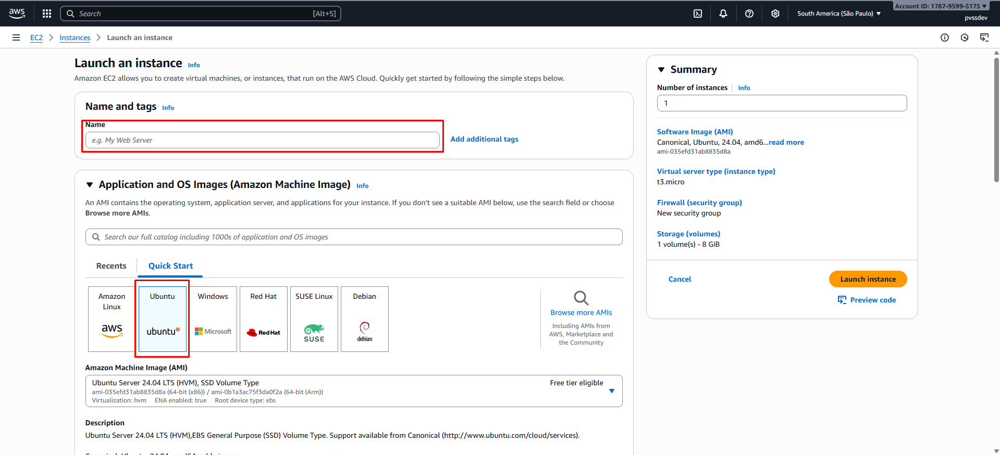
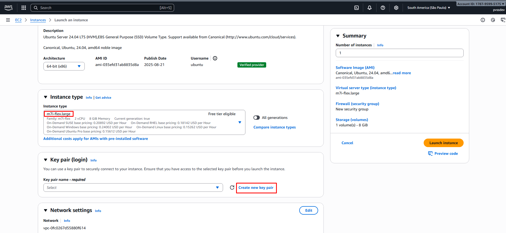
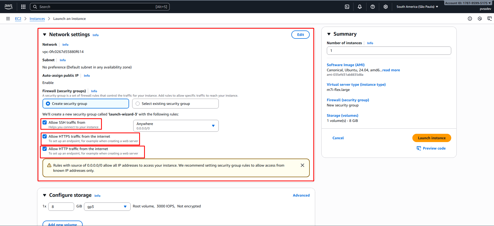
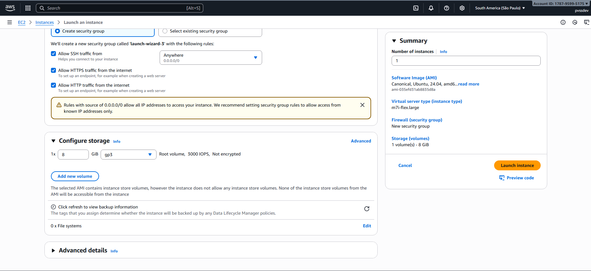
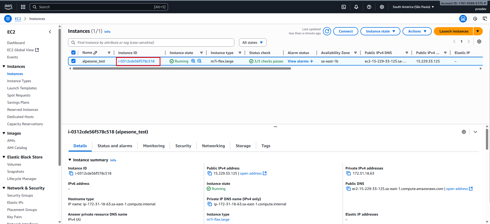
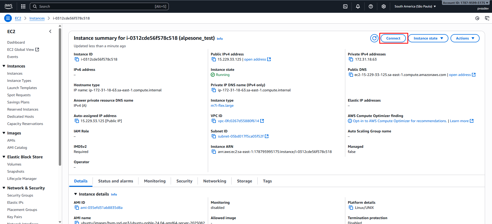
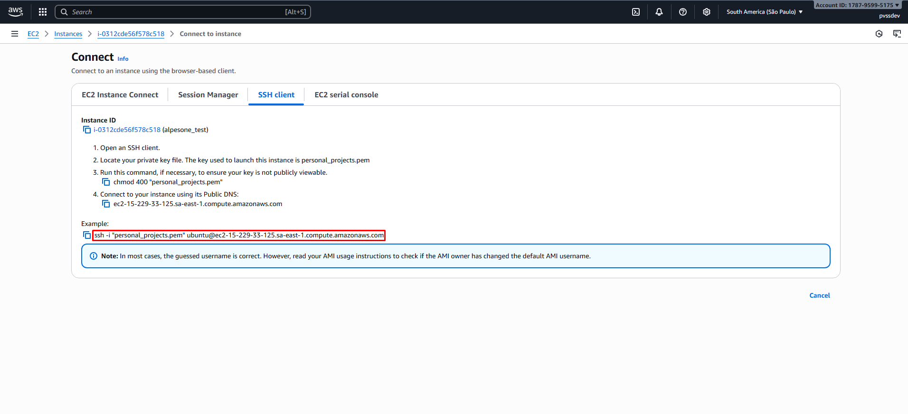

# Documentação do Teste Técnico - Alpes One

## Análise do Teste Técnico da Alpes One

O objetivo principal deste teste é criar uma API básica que fornece dados de um
recurso, configurar um ambiente na AWS para hospedar e implantar essa
aplicação, e demonstrar habilidades em desenvolvimento backend, infraestrutura como serviço (AWS
EC2) e DevOps.

O teste é dividido em três etapas principais:

#### **Etapa 1: Aplicação Laravel**

Nesta fase, o foco é o desenvolvimento backend. Você precisará:

* **Configuração Inicial**: Criar uma aplicação Laravel e configurar o ambiente local com MySQL ou
  SQLite.
* **Comando de Importação (Artisan)**:
    * Desenvolver um comando que baixa e lê o JSON da
      URL `https://hub.alpes.one/api/v1/integrator/export/1902`.
        * Observação: Esta URL só é acessível 2 vezes a cada 30 minutos.
    * Validar e inserir os dados no banco de dados, atualizando os itens existentes.
    * Fazer uma verificação a cada hora se o JSON original foi alterado e aplicar as respectivas
      atualizações na base de dados.
* **API REST**: Criar uma API REST para que seja possível fazer CRUD à base de dados salva.
* **Testes Automatizados**:
    * **Unitários**: Para validar os dados e a lógica do comando de importação.
    * **Integração**: Para testar os endpoints da API, incluindo autenticação e paginação.
* **Documentação**: Incluir instruções para configurar o ambiente, executar o comando de importação, e rodar
  a aplicação e os testes.

#### **Etapa 2: Infraestrutura na AWS**

Aqui você vai demonstrar suas habilidades com infraestrutura como serviço:

* **Instância EC2**: Criar e configurar uma instância EC2.
* **Acesso Público**: Configurar o servidor para permitir acesso público ao endpoint da API.
* **Extras (Diferenciais)**: Configurar um domínio ou subdomínio (ex: `api.suaempresa.com`) e instalar e
  configurar HTTPS.

#### **Etapa 3: Deploy Automatizado**

Nesta última etapa, o objetivo é simplificar o processo de deploy:

* **Script de Deploy**: Criar um script para realizar o deploy da aplicação. O script deve:
    * Copiar os arquivos do código para a instância EC2.
    * Reiniciar o servidor (caso necessário) para aplicar as mudanças.
* **Extra (CI/CD)**: Como um diferencial, configurar um pipeline CI/CD simples utilizando o Bitbucket
  Pipelines ou GitHub Actions para automatizar o deploy em pushes para o branch `main`.

### Entregáveis e Avaliação

* **O que você precisa entregar**:
    * O código-fonte disponível em um repositório Git.
    * A documentação com os passos para rodar a aplicação localmente, como configurar
      a aplicação na instância EC2, e como rodar o script de deploy.
    * A URL pública da API rodando na EC2 (opcional, mas recomendado).
    * Extras como link para documentação Swagger/Postman e descrição da pipeline de
      CI/CD.

* **O que será avaliado**:
    * **Backend**: Qualidade do código (organização, padrões, boas práticas) e
      funcionamento correto dos endpoints.
    * **DevOps**: Capacidade de configurar a infraestrutura na AWS e a configuração
      de servidor e deploy simplificado.
    * **Documentação**: Clareza e completude do README.
    * **Extras**: HTTPS, CI/CD ou qualquer outro diferencial.

## Parte 1: Configuração de Infraestrutura na AWS (EC2) e Instalação do Docker

Este guia detalha o processo de criação e configuração de uma instância EC2 na AWS para hospedar a aplicação, bem como a
instalação do Docker para containerizar nosso ambiente.

### 1.1. Criando a Instância EC2

O primeiro passo é provisionar um servidor virtual na nuvem da AWS.

1. **Acesse o Console da AWS e Navegue até o EC2**:
    * Faça login na sua conta AWS.
    * No campo de busca, digite "EC2" e acesse o serviço.
    * No painel do EC2, clique em "Launch instance".

2. **Nome e Sistema Operacional**:
    * **Name**: Dê um nome descritivo para a sua instância, como `alpesone-test-api`.
    * **Application and OS Images**: Selecione a imagem **Ubuntu**.



3. **Tipo de Instância (Instance Type)**:
    * Para um teste como este, a categoria "Free tier eligible" (nível gratuito) é mais do que suficiente. Recomendo
      selecionar a `m7i-flex.large`.

4. **Par de Chaves (Key Pair)**:
    * Essencial para acessar sua instância via SSH de forma segura.
    * Clique em "**Create new key pair**".
    * Dê um nome para a chave (ex: `alpesone-key`), selecione o formato `.pem` e faça o download.
    * **Guarde este arquivo em um local seguro!** Você não poderá baixá-lo novamente.



5. **Configurações de Rede (Network Settings)**:
    * Aqui configuramos o firewall da instância (Security Group).
    * Marque as seguintes caixas de seleção:
        * `Allow SSH traffic from`: Permite que você acesse o servidor via terminal. Por segurança, o ideal seria
          restringir ao seu IP, mas para o teste, `Anywhere (0.0.0.0/0)` é aceitável.
        * `Allow HTTPS traffic from the internet`: Libera a porta 443, essencial para o acesso à API via HTTPS.
        * `Allow HTTP traffic from the internet`: Libera a porta 80, que usaremos inicialmente e para redirecionamento
          para HTTPS.

   

6. **Configurar Armazenamento (Configure Storage)**:
    * O padrão de 8GB gp3 é suficiente para nossa aplicação, banco de dados e Docker. Pode manter como está.

   

7. **Lançar a Instância**:
    * Revise o sumário à direita e clique em "**Launch instance**".

### 1.2. Conectando à Instância EC2

Após alguns instantes, sua instância estará em execução (`Running`).

1. **Selecione a Instância**: Vá para o dashboard de "Instances" e selecione a instância que você acabou de criar.

   

2. **Obtenha o Comando de Conexão**: Com a instância selecionada, clique no botão "**Connect**" no topo da página.

   

3. **Acesse via Cliente SSH**:
    * Navegue até a aba "**SSH client**".
    * A AWS fornecerá o comando exato para a conexão. Ele será parecido com:
      `ssh -i "sua-chave.pem" ubuntu@ec2-xx-xxx-xx-xxx.sa-east-1.compute.amazonaws.com`

   

4. **Execute o Comando**:
    * Abra um terminal no seu computador.
    * Navegue até a pasta onde você salvou o arquivo `.pem`.
    * **Importante**: Altere as permissões da sua chave, como a própria AWS instrui:
        ```bash
        chmod 400 sua-chave.pem
        ```
    * Agora, copie e cole o comando `ssh` do passo anterior no seu terminal para conectar.

### 1.3. Instalação do Docker e Docker Compose na Instância

Uma vez conectado à sua instância EC2 via SSH, vamos instalar o Docker. Ele nos permitirá rodar a aplicação Laravel e o
MySQL de forma isolada e consistente.

1. **Atualizar o Gerenciador de Pacotes**:
   ```bash
   sudo apt-get update
   sudo apt-get upgrade -y
   ```

2. **Instalar Pacotes de Pré-requisito**:
   ```bash
   sudo apt-get install ca-certificates curl
   ```

3. **Adicionar a Chave GPG Oficial do Docker**:
   ```bash
    sudo install -m 0755 -d /etc/apt/keyrings
    sudo curl -fsSL https://download.docker.com/linux/ubuntu/gpg -o /etc/apt/keyrings/docker.asc
    sudo chmod a+r /etc/apt/keyrings/docker.asc
   ```

4. **Configurar o Repositório do Docker**:
   ```bash
   echo \
    "deb [arch=$(dpkg --print-architecture) signed-by=/etc/apt/keyrings/docker.asc] https://download.docker.com/linux/ubuntu \
    $(. /etc/os-release && echo "${UBUNTU_CODENAME:-$VERSION_CODENAME}") stable" | \
    sudo tee /etc/apt/sources.list.d/docker.list > /dev/null  
   sudo apt-get update
   ```

5. **Instalar o Docker Engine e o Docker Compose**:
   ```bash
   sudo apt-get install docker-ce docker-ce-cli containerd.io docker-buildx-plugin docker compose-plugin
   ```

6. **Adicionar seu Usuário ao Grupo Docker**:
   Isso evita que você precise digitar `sudo` toda vez que for executar um comando docker.
   ```bash
   sudo usermod -aG docker $USER
   ```
   **Atenção**: Após rodar este comando, você precisa **sair da sessão SSH e conectar novamente** para que a alteração
   tenha efeito.

7. **Verificar a Instalação**:
   Após reconectar, verifique se o Docker está funcionando corretamente.
   ```bash
   docker --version
   docker compose version
   docker run hello-world
   ```
   Se você vir a mensagem "Hello from Docker!", a instalação foi um sucesso.

## Arquitetura da Aplicação

A arquitetura desta aplicação foi projetada para ser robusta, escalável e fácil de manter, utilizando uma abordagem
moderna de containerização com Docker e Docker Compose. A aplicação em si é construída sobre o framework Laravel.

A solução é dividida em três serviços principais que operam em conjunto: o **Servidor Web (Nginx)**, a **Aplicação (
PHP-FPM)** e o **Banco de Dados (MySQL)**.

### 1. Visão Geral da Containerização (Docker)

A orquestração dos serviços é gerenciada pelo arquivo `docker compose.yml`, que define o ambiente de produção.

* **`app` (Aplicação PHP)**: Este serviço executa a aplicação Laravel. Ele é construído a partir de um
  `Dockerfile` customizado que utiliza uma imagem `php:8.4-fpm-alpine` como base. A comunicação com o Nginx é
  feita através da porta `9000` na rede interna do Docker.
* **`nginx` (Servidor Web)**: Utiliza a imagem oficial `nginx:1.29-alpine` e atua como a porta de entrada para todas as
  requisições externas. Ele expõe as portas `80` (HTTP) e `443` (HTTPS) para o host. Sua responsabilidade é
  servir os arquivos estáticos, lidar com a terminação SSL (HTTPS) e encaminhar as requisições dinâmicas para o serviço
  `app` (PHP-FPM).
* **`db-mysql` (Banco de Dados)**: Baseado na imagem `mysql:8.0`, este serviço é responsável por persistir todos os
  dados da aplicação, como usuários e veículos. O volume `mysql_data` garante que os dados não sejam
  perdidos ao reiniciar o container.
* **`alpesone_network` (Rede Privada)**: Todos os serviços se comunicam através de uma rede `bridge`
  customizada, garantindo o isolamento e a segurança entre os containers.

### 2. Fluxo da Requisição

1. O cliente (usuário/navegador) faz uma requisição para o domínio `pvss-dev.ddns.net`.
2. A requisição chega no container `nginx` pela porta `80` ou `443`.
3. O Nginx, configurado através do `nginx.conf`, processa a requisição. Se for na porta `80`, ele
   redireciona permanentemente (301) para `https`.
4. Para requisições `https`, o Nginx utiliza os certificados SSL/TLS (gerenciados via Let's Encrypt) para
   estabelecer uma conexão segura.
5. Se a requisição for para um endpoint da API (ex: `/api/vehicles`), o Nginx a encaminha para o serviço
   `app` na porta `9000` para ser processada pelo PHP-FPM.
6. O Laravel recebe a requisição, executa o Controller correspondente (`VehicleController`, por exemplo), interage com o
   Model (`Vehicle`) que, por sua vez, consulta o banco de dados no container `db-mysql`.
7. A aplicação Laravel retorna a resposta em formato JSON.
8. O Nginx recebe a resposta do `app` e a entrega de volta ao cliente.

### 3. Detalhes da Aplicação Laravel

A aplicação segue a estrutura padrão do Laravel (MVC) para organizar a lógica de negócio.

* **Comando de Importação (`app:import-vehicles`)**:
    * Este comando Artisan é o núcleo da sincronização de dados. Ele faz uma requisição HTTP para a API da Alpes One.
    * Para cada veículo retornado, ele executa uma validação rigorosa dos dados.
    * Utiliza o método `updateOrCreate` do Eloquent, usando o campo `board` (placa) como chave única. Isso garante que,
      se um veículo com aquela placa já existir, ele será atualizado; caso contrário, será criado um novo.
    * O comando está agendado para rodar de hora em hora (via Scheduler do Laravel e um Cron no servidor) para manter a
      base de dados local sempre atualizada.

* **API REST e Autenticação**:
    * A API fornece endpoints CRUD completos para o recurso `Vehicle`, gerenciados pelo
      `VehicleController`.
    * A autenticação é feita via token usando o Laravel Sanctum. O `AuthController` lida com o `login` (
      gerando um token de acesso) e o `logout` (invalidando o token). Todos os endpoints da API, exceto o de
      login, são protegidos e exigem um `Bearer Token` válido no cabeçalho da requisição.

### 4. Build da Imagem Docker (`Dockerfile`)

O `Dockerfile` implementa uma construção em múltiplos estágios (*multi-stage build*) para otimizar o tamanho
e a segurança da imagem final.

1. **Estágio `builder`**:
    * Começa com a imagem `php:8.4-fpm-alpine`.
    * Instala as dependências de compilação, extensões PHP necessárias (`pdo_mysql`, `pcntl`) e o
      Composer.
    * Instala as dependências do projeto com `composer install --no-dev --optimize-autoloader`, excluindo
      pacotes de desenvolvimento.

2. **Estágio `production`**:
    * Começa novamente com a mesma imagem `php:8.4-fpm-alpine` limpa.
    * Instala apenas as extensões PHP essenciais para a execução.
    * Copia todos os arquivos da aplicação, já com as dependências instaladas, do estágio
      `builder`. Isso resulta em uma imagem final muito menor, pois não contém o Composer nem as dependências
      de build.
    * Garante que o arquivo `.env` não seja incluído na imagem final por segurança. As variáveis de
      ambiente são injetadas em tempo de execução pelo `docker compose.yml`.
    * Define o usuário `www-data` para executar o processo, uma prática de segurança que evita rodar a
      aplicação como `root`.

# Ambiente de Desenvolvimento Local

Este guia fornece instruções detalhadas para configurar e executar a aplicação localmente utilizando Docker e Docker
Compose.

## Pré-requisitos

Antes de iniciar, verifique se os seguintes softwares estão instalados em sua máquina:

- **Git**
- **Docker**
- **Docker Compose**

### Verificando as instalações

```bash
git --version
docker --version
docker compose --version
```

## Configuração do Ambiente

### 1. Clonando o Repositório

```bash
git clone <url-do-repositorio>
cd <nome-do-projeto>
```

### 2. Configuração das Variáveis de Ambiente

O projeto utiliza um arquivo `.env` para gerenciar as configurações do ambiente.

**2.1. Criar o arquivo de configuração**

```bash
cp .env.example .env
```

**2.2. Configurar as variáveis de ambiente**

Edite o arquivo `.env` e configure as seguintes variáveis principais:

```bash
# Configurações da Aplicação
APP_NAME="Laravel"
APP_ENV=local
APP_KEY=
APP_DEBUG=true
APP_URL=http://localhost

# Configurações do Banco de Dados
DB_CONNECTION=mysql
DB_HOST=db-mysql
DB_PORT=3306
DB_DATABASE=my_database
DB_USERNAME=user
DB_PASSWORD=password
```

## Execução da Aplicação Localmente

### 3. Build e Inicialização dos Containers

Execute o comando abaixo para construir e inicializar todos os containers:

```bash
docker compose up -d --build
```

Este comando irá:

- Baixar as imagens Docker necessárias
- Construir a imagem da aplicação
- Inicializar os containers em modo detached (background)

### 4. Configuração Pós-Execução

Após os containers estarem em execução, execute os seguintes comandos para configurar a aplicação:

**4.1. Gerar a chave da aplicação (APP_KEY)**

```bash
docker compose exec app php artisan key:generate
```

**4.2. Executar as migrações do banco de dados**

```bash
docker compose exec app php artisan migrate
```

**4.3. Popular o banco de dados com dados iniciais**

```bash
docker compose exec app php artisan db:seed
```

**4.4. Gerar a documentação da API (Swagger)**

```bash
docker compose exec app php artisan l5-swagger:generate
```

**4.5. Rodar a importação de dados da API**

```bash
docker compose exec app php artisan app:import-vehicles
```

## Acessando a Aplicação

Após completar todos os passos acima, a aplicação estará disponível nos seguintes endereços:

- **API Principal:** http://localhost
- **Documentação da API:** http://localhost/api/documentation

